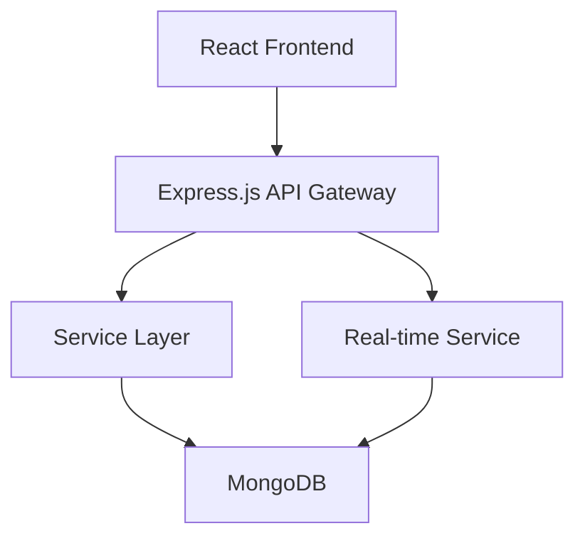

# EduSync System Architecture

## High-Level Architecture



## Component Details

### Frontend (Client)
- **Framework**: React 18+
- **State Management**: Redux Toolkit
- **Routing**: React Router v6
- **UI Library**: Material-UI
- **HTTP Client**: Axios
- **Port**: 3000

### Backend (Server)
- **Runtime**: Node.js 18+
- **Framework**: Express.js 4.x
- **Authentication**: JWT + bcrypt
- **Database**: MongoDB with Mongoose ODM
- **Port**: 5000

### Database
- **Type**: MongoDB
- **ORM**: Mongoose
- **Collections**:
  - Users (students, instructors, admins, parents)
  - Courses (with modules and lessons)
  - Enrollments
  - Submissions
  - Discussions

## API Structure

```
/api/v1/
├── /auth
│   ├── POST /register
│   └── POST /login
├── /users
│   ├── GET /profile
│   └── PUT /profile
├── /courses
│   ├── GET /
│   ├── POST /
│   ├── GET /:id
│   ├── PUT /:id
│   └── DELETE /:id
└── /ws (WebSocket for real-time features)
```

## Data Flow

1. **User Authentication**:
   - User registers/logs in through frontend
   - Credentials sent to `/api/v1/auth` endpoints
   - Server validates and returns JWT token
   - Token stored in localStorage on client

2. **Course Management**:
   - Authenticated users can view courses
   - Instructors/admins can create/update/delete courses
   - Course data stored in MongoDB

3. **Real-time Features**:
   - WebSocket connections for chat and notifications
   - Socket.io server handles real-time communication

## Security

- HTTPS enforcement
- JWT-based authentication
- Password hashing with bcrypt
- Input validation and sanitization
- CORS configuration
- Helmet.js for security headers

## Scalability

- Horizontal scaling for API servers
- MongoDB sharding for large datasets
- CDN integration for static assets
- Microservices-ready architecture